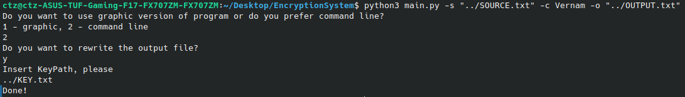

# Python encryption project.


## Table of Contents
- [About](https://github.com/VaganovAlexanderMih/EncryptionSystem/tree/dev#about)
- [Installation and use cases](https://github.com/VaganovAlexanderMih/EncryptionSystem/tree/dev#installation-and-use-cases)
  - [Installation](https://github.com/VaganovAlexanderMih/EncryptionSystem/tree/dev#installation)
  - [Quick Start after installation](https://github.com/VaganovAlexanderMih/EncryptionSystem/tree/dev#quick-start-after-installation)
- [Examples of using](https://github.com/VaganovAlexanderMih/EncryptionSystem/tree/dev#examples-of-using)

## About

This [Encryption System](https://github.com/VaganovAlexanderMih/EncryptionSystem) can encrypt with the Caesar, Vigenere and Vernam ciphers,
as well as decrypt them, and the Caesar cipher can be decrypted both with the use of a key (offset)
and without it (using the method of frequency analysis)
When you use Vigenere and Vernam ciphers, the key is generating automatically
and randomly. You can find it in path that you left for the "key" option.


## Installation and use cases

### Installation


To run, go to the command line and type 

```
git clone --branch dev git@github.com:VaganovAlexanderMih/PythonProjects.git EncryptionSystem
cd EncryptionSystem
pip install -r requirements.txt
python3 main.py --help
```


### Quick Start after installation:

- Write "--source" or "-s" to set source to the file that needed to be coded/decoded
- Write "--cipher" or "-c" to set cipher/decoder (Caesar to set the "Caesar cipher" then offset, Vernam to set "Vernam cipher", Vigenere to set "Viegenere cipher")
- Write "--output" or "-o" to set output file
- Write "--decode" or "-d" to decode file (write nothing if you want to code it)


## Examples of using

Let's see how to work with Vernam cipher:

Source file:


Command sequence to launch the program:



Key file:


Output file:


