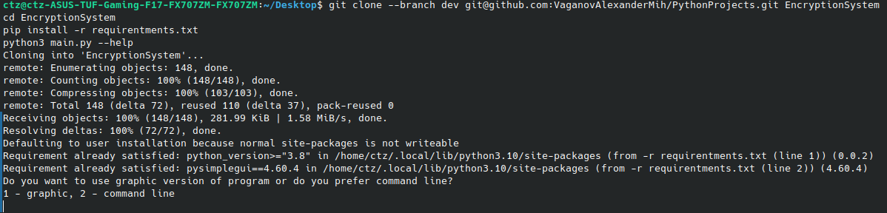

# Python encryption project.


## Table of Contents
- [About](https://github.com/VaganovAlexanderMih/EncryptionSystem/tree/dev#about)
- [Installation and use cases](https://github.com/VaganovAlexanderMih/EncryptionSystem/tree/dev#installation-and-use-cases)
  - [Installation](https://github.com/VaganovAlexanderMih/EncryptionSystem/tree/dev#installation)
  - [Quick Start after installation](https://github.com/VaganovAlexanderMih/EncryptionSystem/tree/dev#quick-start-after-installation)
- [Examples of using](https://github.com/VaganovAlexanderMih/EncryptionSystem/tree/dev#examples-of-using)
- [Recently added]()
- [To do](https://github.com/VaganovAlexanderMih/EncryptionSystem/tree/dev#to-do)

## About

This [Encryption System](https://github.com/VaganovAlexanderMih/EncryptionSystem) can encrypt with the Caesar, Vigenere and Vernam ciphers,
as well as decrypt them, and the Caesar cipher can be decrypted both with the use of a key (offset)
and without it (using the method of frequency analysis)
When you use Vigenere and Vernam ciphers, the key is generating automatically
and randomly. You can find it in path that you left for the "key" option.


## Installation and use cases

### Installation


To run, go to the command line and type 

```
git clone --branch dev git@github.com:VaganovAlexanderMih/PythonProjects.git EncryptionSystem
cd EncryptionSystem
pip install -r requirentments.txt
python3 main.py --help
```

### Quick Start after installation:

Just run next command to know about the syntax and possibilities:

```
man ./EncryptionSystem
```





## Examples of using

Let's see how to work with Vernam cipher:

### Crypting

Source file:


Command sequence to launch the program:


Key file:


Output file:


### Uncrypting

Source file:


Command sequence to launch the program:


Key file:


Output file:


## Recently added:
- basic functionality
- manual for program


## To do:

- [x] Caesar cipher and it's decryption
- [x] Vernam cipher and it's decryption
- [x] Vigenere cipher and it's decription
- [ ] \(Optional) Graphic interface
- [ ] \(Optional) Shorthand with images with extensions "png", "jpg" and "bmt"
- [ ] \(Optional) Some other ciphers and decoders for them
